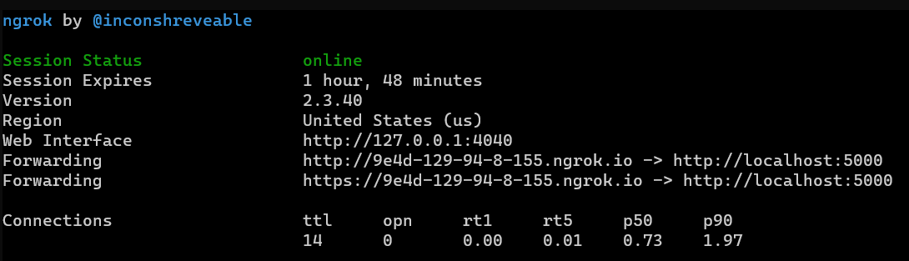
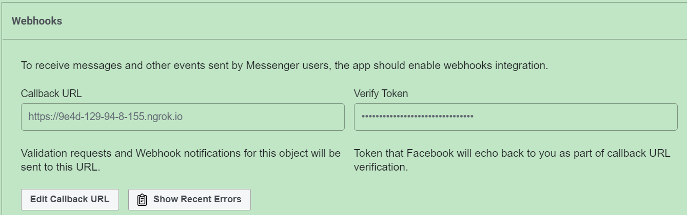
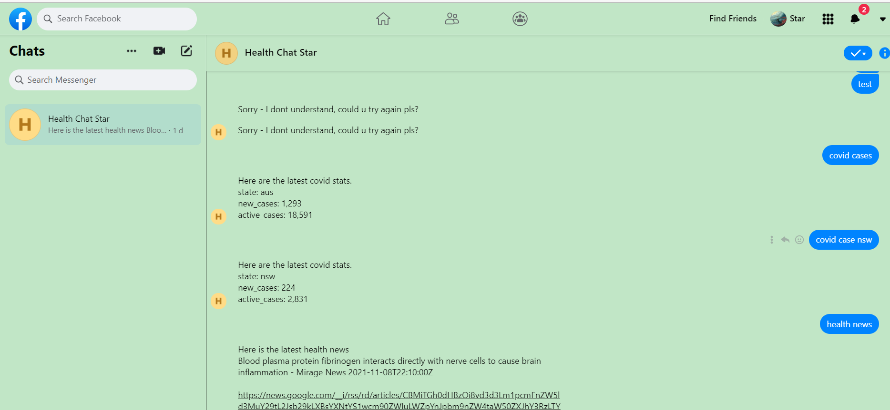

# How to run integration to Facebook Messenger:

## Step 1
Open a new terminal
```sh
$ python3 messenger.py # default port 8000
```
Open a new terminal
```sh
$ cd integration
$ wget https://bin.equinox.io/c/4VmDzA7iaHb/ngrok-stable-linux-amd64.zip
$ unzip ngrok-stable-linux-amd64.zip
$ ./ngrok http 8000 # ur localhost 
```
## Step 2
Copy the callback url, in below example: it is: http://9e4d-129-94-8-155.ngrok.io


Then **change**: 
* verify token to: covid19
* Callback url from the facebook developer portal to this new url at: (It has to be **https** not http) 
https://developers.facebook.com/apps/1486417798399089/messenger/settings/

Account and password see **accounts** file



Comment:  
since free versi of ngrok is used, callback url changes every time, other free vervsion is either not reliable - **too few uses** and not **security** or cannot be **validated** by facebook e.g. localtunnel - which has free subdomin service
Ideally, if we can find a free service that support subdomain (tried) then we don't need to change the callback url in facebook portal every time.
However, since we won't put the project into development, we are ok with the current format.
Note that Dialoglow default callback is not used since it does not support localhost 
Ngrok allows u to expose ur localhost to the outer internet, it is used since it has many users and so truthworth, others currently not considered as reasoned above.
## Step 3
Login a facebook messenger accout and search: **"Health Chat Star"** (we created)

## Step 4
You can Chat with it now. 
**Pls allow** 30s delay since free ngrok
An example as below:


